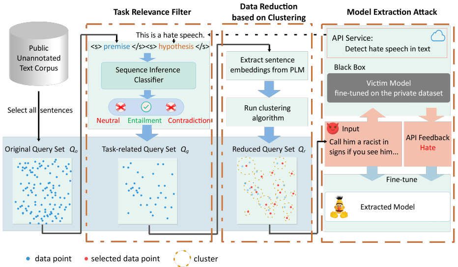

# MeaeQ
Code of our work `MeaeQ: Mount Model Extraction Attacks with Efficient Queries` accpeted as a long paper at EMNLP 2023 main conference. 
## Environment

- Python 3.6 or later
- torch < 1.9.0, torch-1.8.2 may be more stable
- transformers <= 4.22.1
- numpy == 1.23.1
- datasets
- ...

However, in the project's root directory, we have listed my environment configuration in `environment.yml` for reference, which may be inconsistent with the aforementioned recommendation (as I have additionally updated packages in this environment). You can run the following command to create the environment:

```bash
conda env export --name your_environment_name > environment.yml
```

##  Download of Model, Dataset and Query

Before running the model extraction process, you need to download the `pytorch_model.bin` checkpoint file from Hugging Face Model Hub and place it in the `./pretrained_model` directory. The pretrained model checkpoint located at `~/bert_base_uncased` is required because it serves as the base model for both the victim and attack models. Additionally, you can directly download fine-tuned models from related datasets, such as SST-2, from Hugging Face Model Hub.

We reference the download links for the pre-trained models as follows:

- [**bert-base**](https://huggingface.co/bert-base-uncased)
- [**roberta-base**](https://huggingface.co/roberta-base)
- [**xlnet-base**](https://huggingface.co/xlnet-base-cased)
- [**bart-large-mnli**](https://huggingface.co/facebook/bart-large-mnli)

Additionally, we have published simulated victim model weights and datasets for various tasks, queries sampled by different methods at [this location](https://huggingface.co/spaces/wei-cheng/meaeq/tree/main).
You can also run the following commands for simulating more different victim models.
```
cd ./victim
./train_vic.sh
```
You can use the pre-generated queries we have prepared for simulating attacks directly, or you can sample them yourself using the scripts we provide. Refer to "Model Extraction" for more details.

## Model Extraction

To perform model extraction, follow these steps:

1. First, you should sample queries for attacks. Generate queries with different query numbers and methods by running the following script:
```
cd ./shell
./gen_query.sh
```

You can also target different victim models by modifying the settings in the `gen_query.sh` file. The main parameters are as follows.

- **query_num_arr**: an array, the number of quries. You can set `query_num_arr=(20 40 60 80)` to generate 20, 40, 60, 80 quries in one time.
- **task_name**: task name, such as 'SST-2', 'IMDB', 'AGNEWS', 'HATESPEECH'.
- **victim_model_version**: the victim model's architecture. The value ranges in `("bert_base_uncased" "roberta_base" "xlnet_base")`.
- **method**: the method of generating queries, ranging from `("RS" "TRF" "DRC" "MeaeQ")`. 

For `AL-RS` and `AL-US`, we do not implement in this script because active learning requires on-line sampling. Therefore, we implement that in `./steal/model_steal/al_steal.py`. You can run the following commands for activate-learing based sampling and on-line training / evaluation. It will sample the queries, train the attacker's model and evaluate the model at the same time.
```
cd ./shell
./al_train.sh
```

2. Run the following script to start the model extraction process (auto evaluation):
```
cd ./shell
# for main experiment, which employs the bert-base for both vic and steal models.
./train_main_exper.sh
# for cross model extraction, which employs three architectures for both vic and steal models.
./train_cross_exper.sh
```
The test results will be stored in `./steal/model_steal/log` with (accuracy, agreement). Ensure that the queries have been generated in advance (otherwise error will be reported), and the settings in this shell script (`train_main_exper.sh`) match those in the previous shell script (`gen_query.sh`), at least for the settings covering the query generation part. Additional main parameters are as follows.

- **run_seed_arr**: the seed array for reproducing the results. Also, you can experiment several times by setting this array long.


Feel free to adjust the settings and parameters according to your specific use case and requirements. Note that the attacker's model architecture is fixed as `bert-base`, while only the victim models' architecture can be changed. You can implement various attacker models by modifying the `./models/extracted_models.py` file. 

All the configs are stored in `./utils/config.py`.
The python script of generating the query with different methods is stored in `./utils/query_strategy.py`.

## Citation

If you find our work useful in your research, please consider citing:

```bibtex
@misc{dai2023meaeq,
  title={MeaeQ: Mount Model Extraction Attacks with Efficient Queries},
  author={Chengwei Dai and Minxuan Lv and Kun Li and Wei Zhou},
  year={2023},
  eprint={2310.14047},
  archivePrefix={arXiv},
  primaryClass={cs.CL}
}
